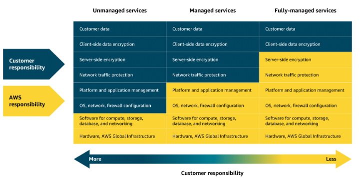
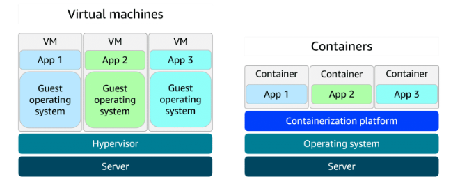

# compute services

## serverless compute

- EC2 is unmanaged service giving you complete control over virtual machines
- managed and serverless services reduce infrastructure management

- FaaS - funcion as a service
- AWS lambda

    * code
    * trigger
    * maximum duration of lambda function is 15 minutes
    * aws takes care of patching, maintenance, scaling, execution and resource allocation etc.
    * lot of languages are supported through runtime
    * you can build custom runtime as well. runtime provides invocation events, context and responses between lambda and function (code)
    * you are charged for compute time consumed
    * price depends on amount of memory allocated to your function
    * good use cases - generate reports

- container orchestration services

    you can deploy containers directly on EC2 instances but it might be too much - handling their network, monitoring their health, starting and stopping them when needed, updating them, managing the networking for them.

    - amazon ECS
    - amazon EKS

- Amazon ECR - elastic container registry

    - OCI standard images

- where do containers run?

    - EC2
    - Amazon Fargate - serverless compute engine for containers.

- containers

    - use host operating system, vms have guest operating systems
    

- Elastic Beanstalk

    - websites
    - simpler provisioning
    - configuration management
    - visibility and control

- Batch - parallel processing, 

- Lightsail - basic web hosting

- Outposts - hybrid

