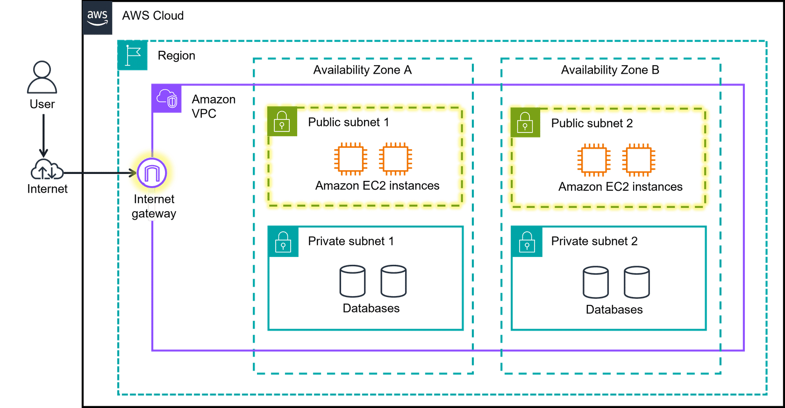
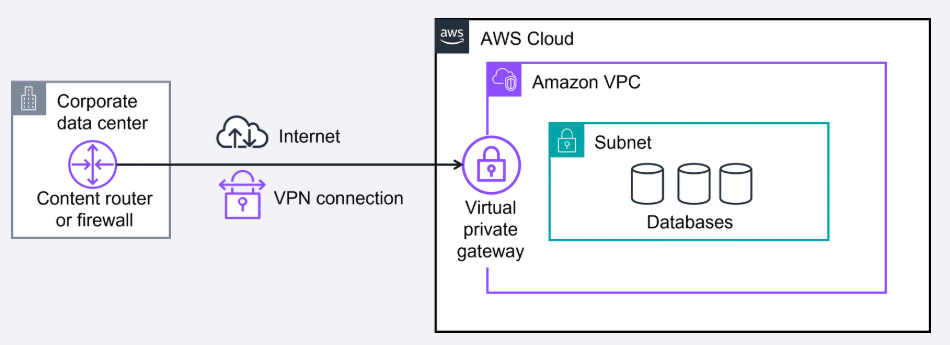

# networking

Network is interconnected devices that can exchange data and resources.

## VPC - virtual private cloud

VPC can have public or private resources. Public resources have access to internet.

VPC lets you provision a logically isolated section of aws cloud where you can launch AWS resources in a virtual network you define.

VPC is a service
VPN

### subnet - is a subsection of network or VPN (virtual private network)

subnets are used to organize resources and can be made publicly or privately accessible.

A subnet is a range of IP addresses in your VPC.

VPC can have internet gateway or virtual private gateway. 

from on premises data center or office network use VPN to VPC in AWS cloud using Virtual Private Gateway. 

**Virtual Private Network**
VPN uses shared network although it is secure connection. VPN creates a connection that is more like a secure tunnel through the internet. Using encryption, it hides and protects everything you send and receive from outside eyes. 

**AWS Direct Connect** is faster than the normal VPN. Helps with regulatory, compliance issues, security and high performance through fiber cable connection direct to aws.

Completely private and dedicated fiber connection. higher bandwidth. reliable.

Direct Connect Partner
