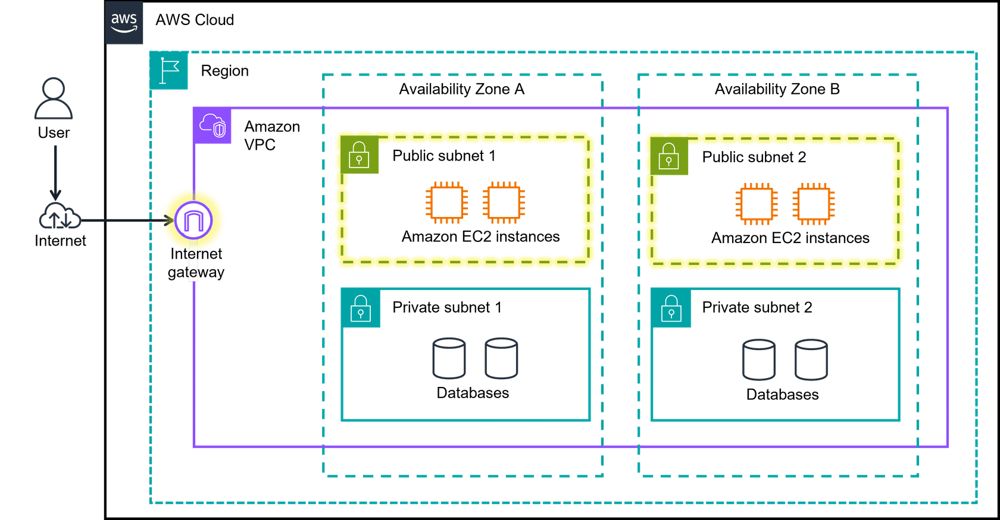
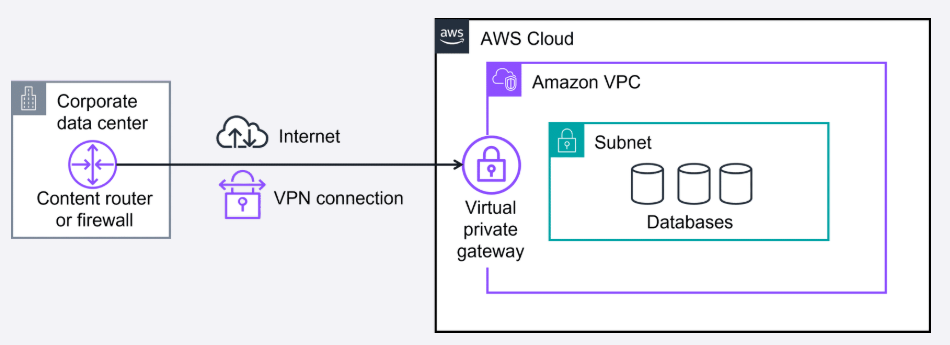

# networking

Network is interconnected devices that can exchange data and resources.

## VPC - virtual private cloud

VPC can have public or private resources. Public resources have access to internet.

VPC lets you provision a logically isolated section of aws cloud where you can launch AWS resources in a virtual network you define.

VPC is a service
VPN

### subnet - is a subsection of network or VPN (virtual private network)

subnets are used to organize resources and can be made publicly or privately accessible.

A subnet is a range of IP addresses in your VPC.

VPC can have internet gateway or virtual private gateway. 

from on premises data center or office network use VPN to VPC in AWS cloud using Virtual Private Gateway. 

**Virtual Private Network**
VPN uses shared network although it is secure connection. VPN creates a connection that is more like a secure tunnel through the internet. Using encryption, it hides and protects everything you send and receive from outside eyes. 

**AWS Direct Connect** is faster than the normal VPN. Helps with regulatory, compliance issues, security and high performance through fiber cable connection direct to aws.

Completely private and dedicated fiber connection. higher bandwidth. reliable.

Direct Connect Partner

IPv4 - 4.3 billion
public IPv4 - every ec2 gets a new one on restart (default)
private IPv4 is fixed and remains same after restart

elastic IP - give a fixed public IPv4 address to a EC2 instance

all public IPs cost money 0.005 dollars per hour

IPv6 - 3.4*10^38 addresses
IPv6 is free

CIDR - fixed bits are listed after slash 192.168.0.0/28 - only last four bits are flexible - 16 addresses (smallest possible)
largest possible 192.168.0.0/16 -

Public subnet - accessible from internet
private subnet - not accessible from internet

Internet Gateways - public subnet has route to the internet gateways

NAT gateways - AWS managed 
NAT instances - self managed

allow instances in private subnet to access internet while remaining private

## VPC flow logs

caputures information about the IP traffic into your interfaces

monitoring and troubleshooting

## VPC Peering

two VPCs connected privately using aws netwrok and behave as if they are one
cant have overlapping cidr ranges
not transitive - must be established for each VPC that needs to connect with another

## VPC endpoints 

how to connect to aws services from private subnet using aws private network (no public network)

VPC endpoint gateway - S3 and dynamoDB

VPV endpoint interface - most services

## PrivateLink

connect to third party VPC

when you need to deal with 100s of VPCs

needs network load balancer (Service VPC) and elastic network interface (ENI)

## Site to site VPN

over public network

customer gateway (on-prem)
Virtual private gateway (AWS VPC)

## Direct Connect (DX)

physical connection between on oprem and aws
takes a month to establish

## AWS client VPN

connect using openVPN over public network to machines in your private network in aws and on-prem
connect using private IP address as if you are part of the private network

## AWS transit gateway

hub and spoke
tranisitive peering between hundreds/1000s of vpcs and on prem
one single gateway
works with direct connect, vpn connections

