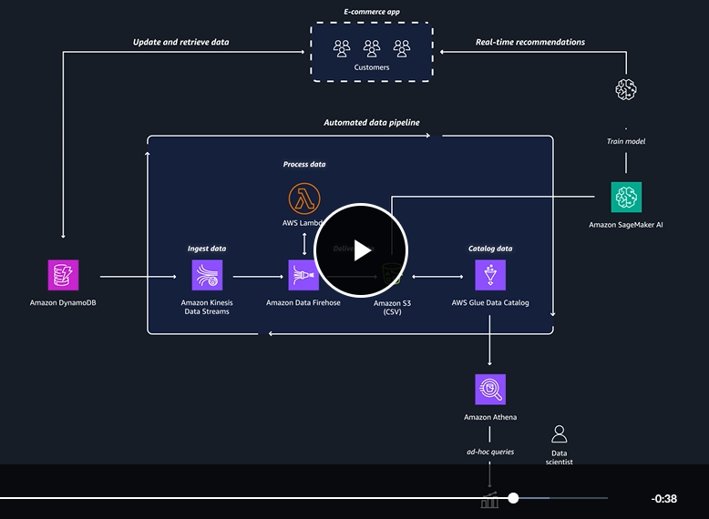

# AI and ML in AWS

AI - is the superset to perform human like tasks
ML - is the subset that performs tasks without explicit instructions

Recommendation and personalization engines are prime focus for ML.

AI - conversational AI based on NLP - natural language processing
another AI can combine historical data with coffee trends on social media

## AI/ML stack

### AI services

- Comprehend - sentiment analysis
- Polly - Text to speech
- Transcribe
- Translate

- Kendra (search)
- Rekognition
- Textract - detects and extracts typed handwritten notes

- Lex - conversational interface
- Personalize

### ML Services

#### SageMaker AI

Choice of ML tools

- IDE for data scientists
- No code for business analysts

Fully managed infra
Repeatable ML workflows

### ML frameworks and infrastructure

total control

using ML frameworks e.g. pyTorch, TensorFlow
specialized chips

for advacned ML workloads
ML-optimized Amazon Elastic Compute Cloud
Amazon EMR
Amazon Elastic Container Service

## Generative AI

Deep learning is a subset of machine learning
Generative AI is a subset of deep learning

Artificial neural networks to mimick humar brain and neurons (mathematical functions) to mimick real human neurons
each layer of neurons feeds data to next layer of neurons

theory was there but not the machines

Large pretrained model to huge data - Foundation models

LLM - Large language models are popular FM (foudation model)
pre-trained FMs can be adapted to perform multiple tasks unlike ML models which are trained to perform single task

- Amazon SageMaker JumpStart — An ML hub with FMs and pre-built ML solutions deployable with a few clicks (still manage/select infra, more control)

- Amazon Bedrock — A fully managed service for adapting and deploying FMs from Amazon and other leading AI companies (quicker compared to sagemaker jumpstart, models through api)

- Amazon Q — An interactive AI assistant that can be integrated with a company's information repositories

## Data Analytics

traditional data analytics is still useful.
AI, ML and data analytics all need data.

Data lake

ETL - Extract Transform and load

load to data warehouse or analytics platforms

ELT is also possible

zero transform is also possible if data is in correct format

Data pipeline

ingestion

Data analytics is when analysts transform raw historical data to uncover valuable insights and trends. This traditional data analysis can apply to important use cases, such as the following:

    Loan companies explaining lending decisions to customers.

    Medical researchers analyzing clinical trial data through hypothesis testing.

    Insurance companies making their risk assessment models transparent for regulators.

### Data pipelines

S3 for datalake
amazon redshift for structured data in warehouses

#### ingestion

**amazon kinesis data stream** for realtime data ingestion
low latency processing

amazon data firehose
near realtime
batch, compress, encrypt
delivers it to destination

#### cataloging

ingested data needs to be cataloged

AWS Glue data catalog
metadata about data
enhances data discovery

#### processing/transformation

AWS Glue for code free data cleaning

Amazon EMR
complex data processing
good for organizations with big data expertize
Apache Spark, Apache Hadoop, and Apache Hive

Amazon Athena
SQL to query all different kind of databases

Amazon Redshift
fully managed data warehouse service
Its columnar storage and massively parallel processing architecture make it ideal for analyzing large datasets

#### visualization

Amazon quicksight - visualization
business intelligence dashboards and reports
amazon Q can help
non technical people can also create and share their reports

amaon opensearch service
real-time search of business and operational data

example data pipeline
