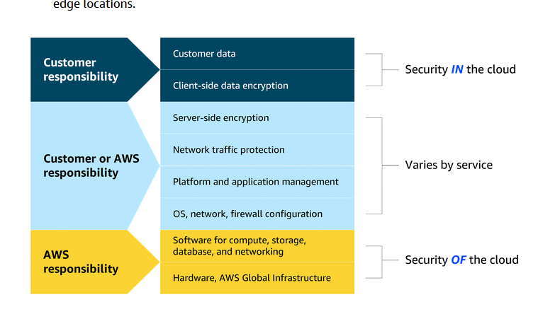

# Security

Authentication and authorization

Cloud security is a shared responsibility

AWS security controls
    Prevent security incidents through proper permission and access management.

    Protect networks, applications, and data.

    Detect and respond to security incidents as they occur.

## IAM Identity and Access Management

root user
strong password
MFA

dont use root user for day to day activities

IAM user - assign policies to user. by default a user has zero permissions

permission - allow / deny
for action and resource
action is aws api call

Groups
users can belong to groups and policies can be assigned to these groups and all users in the group inherit these policies

**Roles**
permissions at scale
roles dont have username and password

can be assumed temporarily
federating users in aws
they can now login using their corporate username and password
and now they can access aws account based on assigned roles
someone will still have to map corporate identity with aws roles

### IAM identity Center

service
sso
authentication through corporate IdP
authorization through roles
federated identity management

### AWS Secrets Manager

### AWS Systems Manager

    Nodes are connection points in a network, system, or structure.
Systems Manager provides a centralized view of nodes across your organization’s accounts and Regions and multi-cloud and hybrid environments. With this service, you can quickly access node information, such as ID and operating system details, and automate registry edits, user management, and security patching.

## protecting networks and applications

DDoS - distributed denial of service attack
UDP Flood

### How AWS helps

Security groups protect against UDP Flood
**Shield Standard** for elastic load balancer, cloudfront and route 53 will protect against DDoS. Free.
**Shield Standard Advanced** paid
WAF - web application firewall - deny list of IP addresses
AWS Regions
The enormous capacity of Regions makes them extremely difficult to overwhelm. It would be massively expensive to achieve.

## protect data

Encryption at rest and in transit
KMS - key management service

protocols
SSL - secure sockets layer
TLS - transport layer security
certificates are used to ensure encrypted connection

### Certificate Manager

### Amazon Macie

With Amazon Macie, you can monitor your sensitive data at rest to make sure it's safe. Macie uses machine learning (ML) and automation to discover sensitive data stored in Amazon S3. You can use Macie to assess your security posture, which is especially helpful for meeting compliance requirements.

## detecting and responding to security incidents

### amazon inspector

runs assessments

## Guard Duty

## detective

security

## Security Hub

one comprehensive hub

insights
