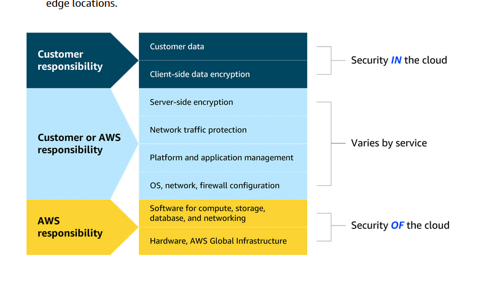

# Security

Authentication and authorization

Cloud security is a shared responsibility

AWS security controls
    Prevent security incidents through proper permission and access management.

    Protect networks, applications, and data.

    Detect and respond to security incidents as they occur.

## IAM Identity and Access Management

root user
strong password
MFA

dont use root user for day to day activities

IAM user - assign policies to user. by default a user has zero permissions

permission - allow / deny
for action and resource
action is aws api call

Groups
users can belong to groups and policies can be assigned to these groups and all users in the group inherit these policies

**Roles**
permissions at scale
roles dont have username and password

can be assumed temporarily
ec2 instance role
lambda function role
roles for cloud formation

**IAM credentials report**
**IAM access advisor**

federating users in aws
they can now login using their corporate username and password
and now they can access aws account based on assigned roles
someone will still have to map corporate identity with aws roles

### STS - Security Token Service
create temporary limited privileges credntials to access AWS resources

### cognito

your app users - create them in cognito instead of creating users for them in IAM

### AWS AD (ative directory)

Managed microsoft ad - establish trust connection with onprem ad
ad connector - users managed on onprem ad
simple AD

### IAM identity Center

one login for multiple aws accounts and applications
service
sso
authentication through corporate IdP
authorization through roles
federated identity management

### AWS Secrets Manager

### AWS Systems Manager

    Nodes are connection points in a network, system, or structure.
Systems Manager provides a centralized view of nodes across your organization’s accounts and Regions and multi-cloud and hybrid environments. With this service, you can quickly access node information, such as ID and operating system details, and automate registry edits, user management, and security patching.

## protecting networks and applications

DDoS - distributed denial of service attack
UDP Flood

### How AWS helps

Security groups protect against UDP Flood
**Shield Standard** for elastic load balancer, cloudfront and route 53 will protect against DDoS. Free.
**Shield Standard Advanced** paid premium DDoS protection
WAF - web application firewall - deny list of IP addresses. filter specific requests based on rules.

Route 53 and cloudFront -attack mitigation at edge
availability protection using  edge network

AWS Regions
The enormous capacity of Regions makes them extremely difficult to overwhelm. It would be massively expensive to achieve.

### WAF

protects from common web exploits (layer 7)
define webACL
depploy on application load balancer, api gateway, cloudFront

### AWS network Firewall

layer 3 to layer 7 protection
traffic can be inspected in any direction

### Firewall manager

all accounts i.e. organization

apply security policies - rules
- network firewall
- shield advanced
- waf
- security groups for EC2, application load balancer

### penetration testing

can be performed without approval for some services

but some activities are prohibited
- flooding
- dos

## protect data

Encryption at rest and in transit
KMS - key management service

### encyption by default
- S3 glacier
- cloudtrail logs
- storage gateway

### encyption opt in

- EBS volumes
- S3 buckets - SSE enabled by default
- databases
- redshift
- EFS drives

### CloudHSM

KMS is software
cloudHSM - is encryption hardware
HSM - hardware security module
with this you manage your own keys yourself

### type of keys
- customer managed keys
- aws managed keys
- aws owned keys - cant see. used by aws across mutiple accounts
- cloudhsm keys - custom keystore, cryptographic operations are performed within cloudhsm cluster

protocols
SSL - secure sockets layer
TLS - transport layer security
certificates are used to ensure encrypted connection

### AWS Certificate Manager

provision, manage and deploy SSL/TLS certificates
free for public tls certificates

### AWS secrets manager

manages secrets

secrets are encrypted with kms

mostly for rds integration

### AWS artifact

portal not service

artifact reports - security and compliance 
artifact agreements

support internal audit and compliance

### aws CONFIG

record configuration and changes over time
for auditing and recording compliance

### Amazon Macie

With Amazon Macie, you can monitor your sensitive data at rest to make sure it's safe. Macie uses machine learning (ML) and automation to discover **sensitive data** stored in Amazon S3. You can use Macie to assess your security posture, which is especially helpful for meeting compliance requirements.

## detecting and responding to security incidents

### amazon inspector

automatically runs assessments
integrated with security hub

ec2 os, lambda vulnerabilities, container image assessment
network reachability 

## Guard Duty

intelligent threat discovery for account
ML
can setup eventbridge rules for notifications

## detective

find root cause for security issues

## Security Hub

one comprehensive hub

insights

## AWS abuse

spam email from aws IP - 

## IAM Access Analyzer

Zone of trust - AWS account or AWS Organization

identify which resources are shared externally

