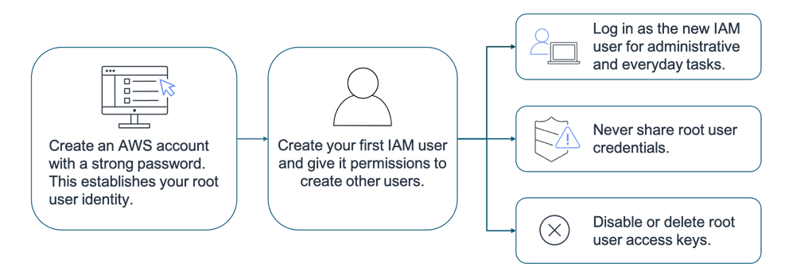

# intro

test environment can in provisioned so much faster in cloud than on-premises

Some repetitive common tasks don’t differentiate your business, like installing virtual machines (VMs) or storing backups. By removing these tasks, you can focus on what is strategically unique to your business and let AWS handle the time-consuming tasks that don’t separate you from your competitors, we refer to this as removing "undifferentiated heavy lifting".

## global infrastructure

data centers are connected by redundant low latency and high speed links.

which region to use

- compliance
- latency
- pricing
- service availability

edge network
Edge locations

cloud front to cache content in edge locations

## interacting with aws

- console
- cli
- sdk

## shared responsibility model

A key concept is that customers maintain complete control of their data and are responsible for managing the security related to their content. For example, you are responsible for the following:

    Choosing a Region for AWS resources in accordance with data sovereignty regulations
    Implementing data-protection mechanisms, such as encryption and scheduled backups
    Using access control to limit who can access your data and AWS resources

## protect root user

use strong password

MFA

supported devices 

virtual
hardware TOTP - time-based one-time password 
FIDO security keys

create other admin user

access keys for cli and api

    Access key ID: for example, A2lAl5EXAMPLE
    Secret access key: for example, wJalrFE/KbEKxE

## Identity and access management

IAM is free and global

organize users as groups
assign policies to groups

policy are json based documents
version
effect - allow or deny
action - any aws api call
resource

authentication - Are you who you say you are
authorization - What actions can you perform

identity federation - IAM supports identity federation, which allows users with passwords elsewhere—like your corporate network or internet identity provider—to get temporary access to your AWS account.

### Roles

policies can be attached to roles just like with users and groups

users can assume a role temporarily

Maintaining roles is more efficient than maintaining users. When you assume a role, IAM dynamically provides temporary credentials that expire after a defined period of time, between 15 minutes and 36 hours. Users, on the other hand, have long-term credentials in the form of user name and password combinations or a set of access keys.

User access keys only expire when you or the account admin rotates the keys. User login credentials expire if you applied a password policy to your account that forces users to rotate their passwords.

AWS managed policies seem very permissive - all resources (*)