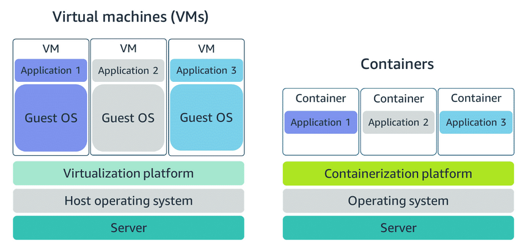

# AWS Compute

Servers

The first building block that you need to host an application is a server. Servers can usually handle HTTP requests and send responses to clients following the client-server model. Although any API-based communication also falls under this model. 

3 types -

- virtaul machines
- container services
- serverless

## EC2 (Amazon Elastic Compute Cloud)

AMI - machine image, you can also build your own

Amazon EC2 is a web service that provides secure, resizable compute capacity in the cloud

When you launch a new instance, AWS allocates a virtual machine that runs on a hypervisor. Then the AMI that you selected is copied to the root device volume, which contains the image that is used to boot the volume. In the end, you get a server that you can connect to and install packages and additional software on.

Unless otherwise specified, when you launch EC2 instances, they are placed in a default virtual private cloud (VPC). The default VPC is suitable for getting started quickly and launching public EC2 instances without having to create and configure your own VPC.

Any resource that you put inside the default VPC will be public and accessible by the internet, so you shouldn’t place any customer data or private information in it.

When architecting any application for high availability, consider using at least two EC2 instances in two separate Availability Zones. ­­

You only pay for the running time (and stopping time when stop-hibernate)

When you stop-hibernate an instance, Amazon EC2 signals the operating system to perform hibernation (suspend-to-disk), which saves the contents from the instance memory (RAM) to the EBS root volume. You can hibernate an instance only if hibernation is turned on and the instance meets the hibernation prerequisites.

in both stop and stop-hibernate, state is saved to EBS attached to root device.

dedicated host - license compliance

IAM instance profile is the role

even when instance is in running state, still need to wait for status checks to pass

instance level security group  to allow http traffic and disable ssh

## Container services

certain UNIX kernels (the central core of the operating system) having the ability to separate their processes through isolation
containers are portable
getting software to run reliably when it moves from one compute environment to another

Containers share the same operating system and kernel as the host that they exist on

container orchestrator is needed

In AWS, containers can run on EC2 instances.

container orchestrator does following -
How to place your containers on your instances
What happens if your container fails
What happens if your instance fails
How to monitor deployments of your containers

Amazon Elastic Container Service (Amazon ECS) and Amazon Elastic Kubernetes Service (Amazon EKS).

## Serverless

lose some control for convenience

Spend time on the things that differentiate your application, rather than spending time on ensuring availability, scaling, and managing servers.

undifferentiated heavy lifting

There are no servers to provision or manage.
It scales with usage.
You never pay for idle resources.
Availability and fault tolerance are built in.

### Fargate

no need to manage EC2 instances needed by ECS. not required to manage the underlying compute infrastructure.

Task‑level isolation (each task is its own micro‑VM)

### Lambda

there are no servers to manage. You get continuous scaling with subsecond metering and consistent performance.

< 15 minutes

quick processing

A function is a resource that you can invoke to run your code in Lambda.
Triggers describe when a Lambda function should run. 
An event is a JSON-formatted document that contains data for a Lambda function to process.
