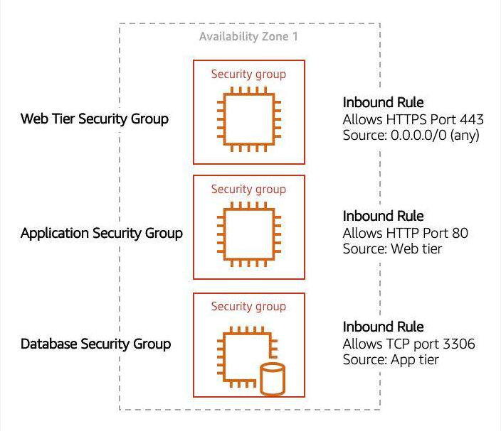

# networking

Networking is how you connect computers around the world and allow them to communicate with one another.

ip address has 32 bits

each octet is converted to decimal and then one sees the IP address that we are used to.

192.168.1.30

Classless Inter-Domain Routing (CIDR)

CIDR notation is a compressed way of representing a range of IP addresses

192.168.1.0/24 - first 24 bits are fixed and last 8 bits are flexible

range of 192.168.1.0/24 is smaller than 192.168.1.0/16

In AWS, the smallest IP range you can have is /28, which provides 16 IP addresses.

The largest IP range you can have is a /16, which provides 65,536 IP addresses.

## VPC

To maintain redundancy and fault tolerance, create at least two subnets configured in two Availability Zones.

belongs to a region
has a CIDR range

has subnets
also has a CIDR range which is a subset of vpc's cidr range

subnets belong to an az

internet gateway

virtual private gateway - for encrypted virtual private network

both these gateways need to be attached to a VPC

For AWS to configure your VPC appropriately, AWS reserves five IP addresses in each subnet. 

10.0.0.0/22 VPC has 1024 addresses
it has 4 subnet, each subnet has /24 cidr range and 256 ip addresses
5 IPs in each subnet are reserved

### direct connect

## Routes

main route table for VPC
all components in VPC can talk to each other locally by default

default route's destination is CIDR range of the VPC and target is local.

this local route is present in all VPCs

route table when attached to internet gateway have internet access

we need to create new custom route tables

route table has routes (set of rules)

what does 0.0.0.0/0 mean? catch all - all IPv4 addresses

route tables target is internet gateway
destination is all IP addresses

associate route to subnets

Each custom route table that you create will have the local route already inside it, allowing communication to flow between all resources and subnets inside the VPC.

## Security

Cloud security at AWS is the highest priority. You benefit from a data center and network architecture that is built to meet the requirements of the most security-sensitive organizations.

two options to protect/secure

### nacl - each subnet has default nacl (network ACL)

virtual firewall at the subnet level
stateless
inbound and outbound rules
everything is allowed by default
can allow and deny

you allow inbound 443 and outbound range 1025–65535. That’s because HTTPS uses port 443 to initiate a connection and will respond to an ephemeral port. 

### security groups

at EC2 instance level
stateful, if inbound traffic is allowed. dont have to explicitly open outbound port.
The default configuration of a security group blocks all inbound traffic and allows all outbound traffic.
you can only allow

