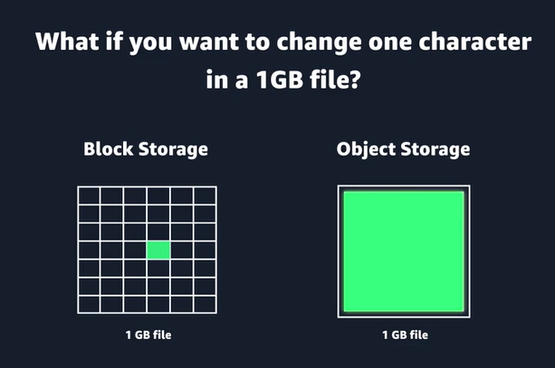

# storage

easy to modify files in block storage

- file - Network attached storage. Network storage shines in places where multiple machines need to access the same data reliably, concurrently, and with strong consistency.
- block - low latency - Direct attached storage, storage area network. system or application files have high transaction rate.  OS still needs a bootable block device.
 it’s about I/O pattern, latency, and bootability.

- object - stored in buckets. doesnt have hierarchy as in file. WORM - write once and read many times data goes here. Object storage is great for:
  - backups
  - images
  - logs
  - archives

The simplest way to remember it
Block storage = one machine, high performance, OS disks
Network storage = many machines, shared access, collaboration
Object storage = infinite scale, cheap, not POSIX

POSIX = Portable Operating System Interface

POSIX is the rulebook that makes Unix‑like systems behave consistently.

## EFS

Amazon Elastic File System (Amazon EFS) is a set-and-forget file system that automatically grows and shrinks as you add and remove files. 

storage classes

- standard frequent access 
- standard infrequent access
- onezone frequent access 
- onezone infrequent access

### Amazon FSx

Amazon FSx is a fully managed service that offers reliability, security, scalability, and a broad set of capabilities that make it convenient and cost effective to launch, run, and scale high-performance file systems in the cloud.

-  NetApp ONTAP
- OpenZFS - linux based fileservers
- for Lustre -  for applications that require fast storage. You can link FSx for Lustre file systems to data repositories on Amazon Simple Storage Service (Amazon S3) or to on-premises data stores.
- windows file server - FSx for Windows File Server provides file storage that is accessible over the Service Message Block (SMB) protocol and has the ability to serve as a drop-in replacement for existing Windows file server deployments. 

## EBS

The unique characteristics of block storage make it the preferred option for transactional, mission-critical, and I/O-intensive applications.

Amazon EC2 instance store - ephemeral storage - goes away after the EC2 instance is stopped/terminated. Amazon Elastic Compute Cloud (Amazon EC2) instance store provides temporary block-level storage for an instance. This storage is located on disks that are physically attached to the host computer.

Most external drives can only be connected with one computer at a time.

persistent storage - EBS

Amazon Elastic Block Store (Amazon EBS) is block-level storage that you can attach to an Amazon EC2 instance.
all ec2 instance have a root volume which is ebs
if vm can be stopped and restarted it has ebs volume

hdd backed - cold, throughput optimized (faster)
ssd backed - general purpose, provisioned iops (faster)

## S3 (object storage)

Object storage is built for the cloud and delivers virtually unlimited scalability, high durability, and cost effectiveness.

buckets can have folders and files
by default, all data is private

access can be granted in ACL or bucket policies

max size of one object is 5 TB

bucket name is unique globally

A partition is a grouping of Regions, of which AWS currently has three: Standard Regions, China Regions, and AWS GovCloud (US).

bucket name is unique within a partition

Amazon S3 supports buckets and objects, and there is no hierarchy. However, by using prefixes and delimiters in an object key name, the Amazon S3 console and the AWS SDKs are able to infer hierarchy and introduce the concept of folders.

2022-03-01/Cats.jpg
2022-03-01/AmazonS3.html

use cases

- backup
- media - Because you can store unlimited objects, and each individual object can be up to 5 TB, Amazon S3 is an ideal location to host video, photo, and music uploads.
- software delivery - packages that others will download
- data lakes
- static website
- static content