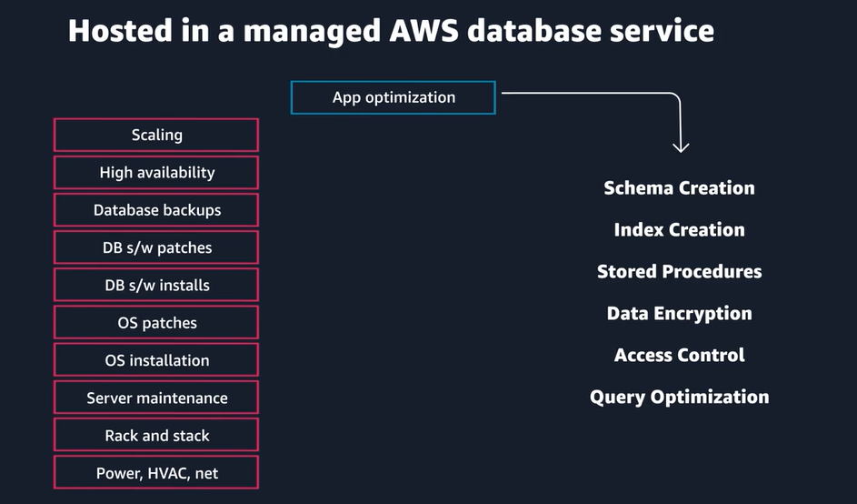

# databases

## RDS

aurora - native cloud replacement for postgresQL and mysql databases and significantly faster

RDS multi-az support - standby db in different az. data is replicated automatically. Failover is initiated automatically.

When you create a DB instance, a Domain Name System (DNS) name is provided. AWS uses that DNS name to fail over to the standby database.

Just like the databases you build and manage yourself, Amazon RDS is built from compute and storage. The compute portion is called the database (DB) instance, which runs the DB engine.

The storage portion of DB instances for Amazon RDS use Amazon Elastic Block Store (Amazon EBS) volumes for database and log storage.

RDS charges for per hour of running time just like EC2 instances

## purpose built databases

### Amazon DynamoDB - key value and document

Although DynamoDB is the database of choice for high-scale and serverless applications, it can work for nearly all online transaction processing (OLTP) application workloads.

### Amazon ElastiCache

ElastiCache is a fully managed, in-memory caching solution. It provides support for two open-source, in-memory cache engines: Redis and Memcached. You aren’t responsible for instance failovers, backups and restores, or software upgrades.

### Amazon MemoryDB for Redis

MemoryDB is a Redis-compatible, durable, in-memory database service that delivers ultra-fast performance.

### DocumentDB - mongodb, content management

### qldb

quantum ledger - nothing can ever be deleted. good for things that will get audited

### neptune - graph db - highly connected data

social media kind of relationships

### Amazon Keyspaces (for Apache Cassandra) - wide column

Amazon Keyspaces is a scalable, highly available, and managed Apache Cassandra compatible database service.

## DynamoDB

With Amazon DynamoDB, you can build internet-scale applications supporting user-content metadata and caches that require high concurrency and connections for millions of users and millions of requests per second.

encryption at rest
cloudtrail logs
IAM access control
