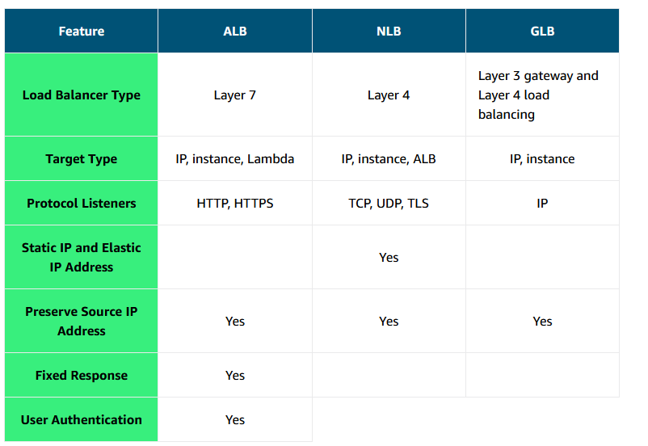
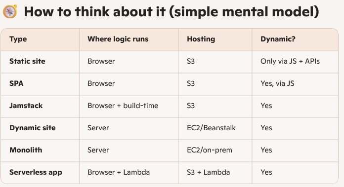

# Monitoring

You need a way to collect and analyze data about the operational health and usage of your resources.The act of collecting, analyzing, and using data to make decisions or answer questions about your IT resources and systems is called monitoring.

datapoint generated by services is called metrics

metrics over time is called statistic

baseline

deviation from baseline

## CloudWatch

Many AWS services automatically send metrics to CloudWatch for free at a rate of 1 data point per metric per 5-minute interval.

to watch all this in one central location

dashboard
alarms
custom metrics

### CloudWatch Logs

CloudWatch Logs terminology

event
stream - event from same resource
group - A log group is composed of log streams that all share the same retention and permissions settings.

## optimization

types of high availability

active passive
active active - stateless apps

### Elastic load balancing

Monitoring is an important part of load balancers because they should route traffic to only healthy EC2 instances.

application level - layer 7 - can have rules

### Auto scaling

Amazon EC2 Auto Scaling helps you maintain application availability. You can automatically add or remove EC2 instances using scaling policies that you define.

The Amazon EC2 Auto Scaling service adds and removes capacity to keep a steady and predictable performance at the lowest possible cost. 

Automatically replaces unhealthy EC2 instances.

ELB with Amazon EC2 Auto Scaling

Additionally, the ELB service integrates seamlessly with Amazon EC2 Auto Scaling. As soon as a new EC2 instance is added to or removed from the Amazon EC2 Auto Scaling group, ELB is notified. However, before ELB can send traffic to a new EC2 instance, it needs to validate that the application running on the EC2 instance is available.

This validation is done by way of the ELB health checks feature you learned about in the previous lesson. 

launch template is preferred over launch configuration

Auto Scaling groups
desired, minimum, maximum

scaling policies

simple
step
target tracking

## rearchitect

Static Websites
Dynamic Websites (Server‑Rendered)
Single-Page Applications (SPAs)

Monolithic Web Apps - .NET MVC

