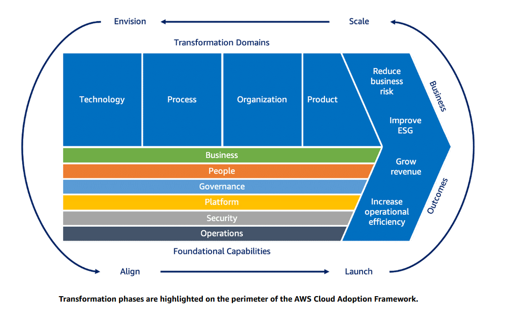

# Cloud Adoption Framework

4 phases

- envision - senior leadership, establish migration vision and strategy, define business objectives, desired outcomes, and success metrics, identify stakeholders
- align - identified stakeholders assess gaps across six perspectives, identify cross-organization dependencies, develop targeted strategies to enhance cloud readiness, lays groundwork for successful cloud migration
- launch - deliver first set of cloud migration initiatives, execute adoption plan, establish operational process and support model, lessons learnt refine the approach
- scale - expand successful cloud migration initiatives, confirm anticipated benefits

6 perspectives

- business
- process
- governance
- platform
- security
- operations

## Migration Strategies

7 migration strategies

- relocate - from data center to aws (vmware cloud) - entire virtualized environment and not just the server. hypervisor level move
- rehost - lift and shift, export and import VMs (servers)
- replatform - lift, tinker and shift
- retain
- retire
- refactor
- repurchase

## Well-Architected Framework

6 pillars

- Operational excellence
- Security
- Reliability
- Performance efficiency
- Cost optimization
- Sustainability
