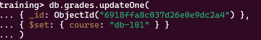
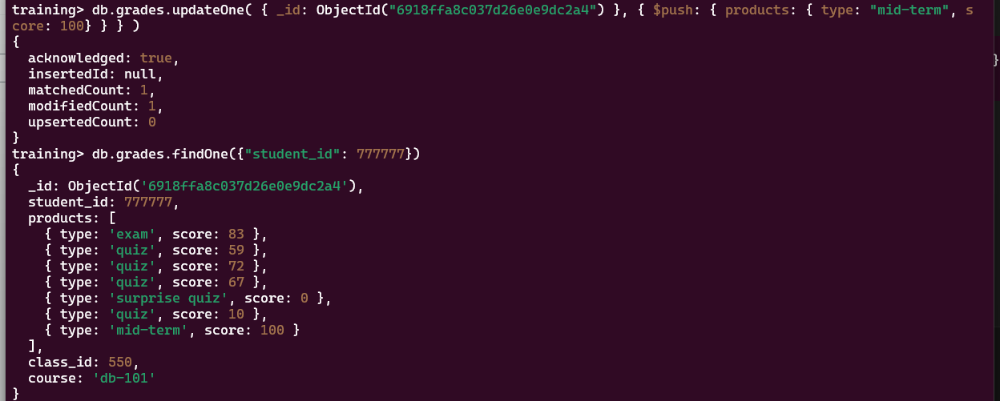

# CRUD

## Insert

1. insert

    - if not provided _id is generated by default
    - ObjectId() generates a new object id. And it can be passed a part of document. But it cant be passed twice else it will give duplicate error
    - newly inserted objects _id is returned along with acknowledged message
    - notice that its not json - even the last elements/fields have comma at the end

    ```mongosh
    db.grades.insert({
        "student_id": 100,
        "products": [
            {
                "type": "quiz",
                "score": 70,
            },
            {
                "type": "homework",
                "score": 60,
            },
        ],
    })
    ```

1. insertMany - takes and list of documents

- returns id of all inserted documents

## Retrieve

1. find() - returns a cursor
    shell command/directive "it" iterates over the cursor

1. findOne()
    returns one

### Find Operators

1. $eq - can be ignored. shortcut field: value (implicit eq) can be used instead

    ```mongosh
    db.zips.find({city: {$eq: "AUSTIN"}})
    db.zips.find({city: "AUSTIN"})
    ```

1. $in -

    ```mongosh
    db.zips.find({city: {$in: ["AUSTIN", "HOUSTON]}})
    ```

## Update

1. updateOne()

    - Options:

        1. upsert: true

### Update Operators

1. $set

        adds/updates a field with provided value



1. $push

        to add elements to an array



1. updateMany()

not an all-or-nothing operation
doesnt rollback updates automatically.
you are responsible

lacks isolation - update are visible as soon as they are performed. its not a batch operation.

## Delete

1. deleteOne

1. deleteMany

Wrappers

1. ObjectId
2. ISODate

mongosh is built on nodejs

its commands are javascript (ECMAScript) with mongosh extensions
but javascript features such as map, filter, forEach can also be used.

```js
db.grades.find().forEach((student) => { print(`id is ${student.student_id}`); });
```
