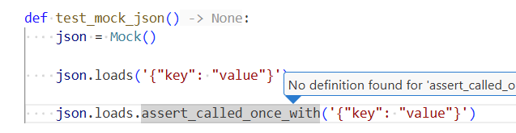

# VS Code tips and tricks

- intellisense not working

  - ensure interpreter is selected
  - ensure language server is selected as place
  - extrapaths should include workflow folder
  - here is how settings file will look

```json
{
    "python.testing.pytestArgs": [
        "src"
    ],
    "python.testing.unittestEnabled": false,
    "python.testing.pytestEnabled": true,
    "python.defaultInterpreterPath": "${workspaceFolder}/.venv/bin/python",
    "python.languageServer": "Pylance",
    "python.autoComplete.extraPaths": ["${workspaceFolder}"]
}
```

- if F12 is not working on a symbol, it may be because attribute was created lazily.
